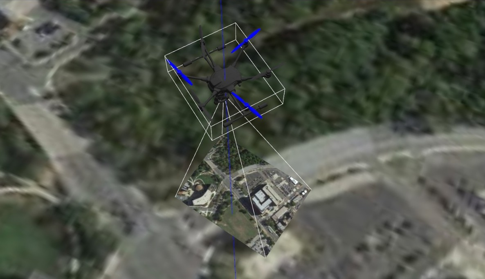

# CamDroneLoc

Visual Odometry for Drones using a Particle Filter Approach with Image Encoding Measurements

### Authors

<ul>
<li> Vinay Lanka (vlanka@umd.edu)
<li> Vikram Setty (vikrams@umd.edu)
<li> Mayank Deshpande (msdeshp4@umd.edu)
</ul>

### Overview

In this project, we present a vision-based method that uses camera image input for localization and visual odometry in a mapped environment by using an encoder to encode camera input which is then used as the measurement for a particle filter localization system. We assume a setup where a drone with constant zero pitch and roll is moving around in a mapped environment with a monocular camera facing down at all times (with a shutter speed high enough to prevent image imperfections while moving at high speeds). We also assume known control inputs (within the limits of reasonable error) to drive the drone in a particular desired motion.

### Image Encoding

We experiment with and make use of three different image encoders to generate inputs for the Particle Filter's measurement model. They include the following.

<ul>
<li> CNN-based Encoder
<li> VecKM-based Encoder
<li> Histogram of Features Encoder
</ul>

### Particle Filter

#### Motion Model

The velocity of the drone is updated using local ododmetry measurements from the drone's IMU.

#### Measurement Model

The measurement model uses the similairity score between the encoded image vectors to update the weights of and resample particles. The different similarity score methods used include the following.

<ul>
<li> CNN-based Encoder: Cosine Similarity
<li> VecKM Encoder: Inner Product Sum
<li> Histogram of Features Encoder: Histogram Correlation and Intersection
</ul>

#### Update Step

Systematic Resampling is used with a weighting method reflecting the Bayes Theorem every couple iterations.

### Results

Fast convergence of particles to the ground-truth drone location is observed by visual results as well as obtained odomtery readings by the *average* particle in the Particle Filter. The depiction of the same by running the Particle Filter Model that uses VecKM-based Encodings in a realistic Gazebo PX4 SITL world is shown below.

[](https://drive.google.com/file/d/1LihlSgeTUfliR2FKWrQg5qaWYqrT-apc/view?usp=sharing)


### Executing the Code

To run the Particle Filter model independtly of ROS, execute the following command.

```sh
    python3 particle_filter.py
```

To run the Particle Filter model with ROS (to listen to and publish ROS Topics), execute the command below.

```sh
    python3 particle_filter_ros.py
```